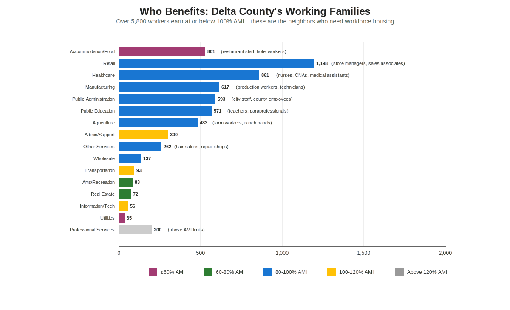
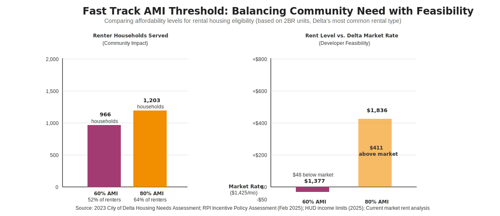
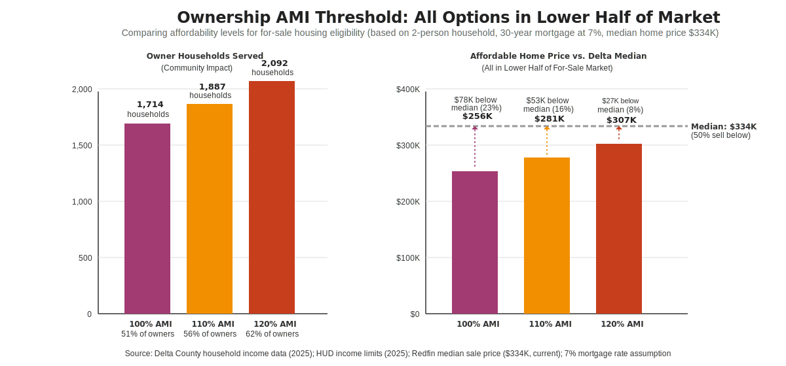
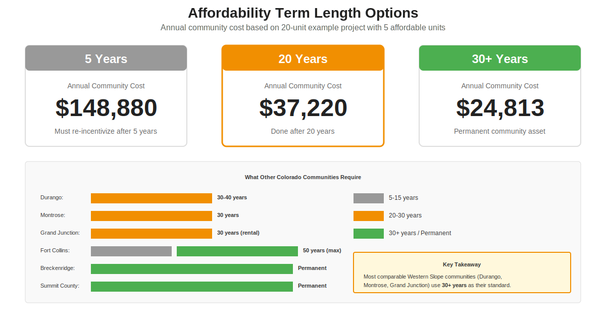

# Fast Track Program: Quick Reference Guide
**City of Delta Focus Group - November 18, 2025**

---

## What is AMI (Area Median Income)?

**AMI** = Area Median Income for Delta County (2025)
- Used to determine who qualifies for affordable housing
- Based on household size and income
- Set annually by HUD (U.S. Department of Housing and Urban Development)

### 2025 Delta County AMI Thresholds

| AMI Level | 1-Person | 2-Person | 3-Person | 4-Person | Max Rent (2P)* | Max Purchase (2P)** |
|-----------|----------|----------|----------|----------|----------------|---------------------|
| **60% AMI** | $34,140 | $39,020 | $43,900 | $48,780 | $976/mo | $154,000 |
| **80% AMI** | $45,550 | $52,050 | $58,550 | $65,050 | $1,301/mo | $205,000 |
| **100% AMI** | $56,950 | $65,100 | $73,200 | $81,300 | $1,628/mo | $256,000 |
| **110% AMI** | $62,645 | $71,610 | $80,520 | $89,430 | $1,790/mo | $281,000 |
| **120% AMI** | $68,340 | $78,120 | $87,840 | $97,560 | $1,953/mo | $307,000 |

*Maximum affordable rent = 30% of monthly income
**Maximum affordable purchase price based on standard mortgage qualifications

---

## Who Benefits from Workforce Housing?

Over 5,800 Delta County workers (88% of the workforce) earn at or below 100% AMI. These are the nurses, teachers, retail workers, restaurant staff, and public employees who serve Delta's community and economy every day.

*AMI classifications based on 2-person households with two workers in similar industries*

---

## Decision #1: Rental AMI Threshold

### Current Delta Market Context
- **Market Rate:** $1,425/month (2BR rental)
- **Renter Households:** 1,869 total households seeking housing

| Threshold | Affordable Rent | Market Gap | Households Served | % of Renters |
|-----------|----------------|------------|-------------------|--------------|
| **60% AMI** | $1,377/mo | $48 below market | 966 households | 52% |
| **80% AMI** | $1,836/mo | $411 above market | 1,203 households | 64% |

**Question for Discussion:** Are eligibility requirements reflective of Delta's housing needs and development demands?

---

## Decision #2: Ownership AMI Threshold

### Current Delta Market Context
- **Median Home Price:** $334,000
- **Owner Households:** 3,356 total households seeking housing

| Threshold | Affordable Price | Below Median | Households Served | % of Owners |
|-----------|-----------------|--------------|-------------------|-------------|
| **100% AMI** | $256,000 | $78K (23%) | 1,714 households | 51% |
| **110% AMI** | $281,000 | $53K (16%) | 1,887 households | 56% |
| **120% AMI** | $307,000 | $27K (8%) | 2,092 households | 62% |

**Note:** All three options target lower half of Delta's for-sale market (median = 50% sell below)

**Question for Discussion:** Are eligibility requirements reflective of Delta's housing needs and development demands?

---

## Decision #3: Affordability Term Length

### Affordability Term Options

| Term Length | Annual Cost* | Total Cost* | 20-Year Equivalent | Status After Term |
|-------------|--------------|-------------|-------------------|-------------------|
| **5 years** | $148,880/year | $744,400 | $2,977,600 | Must re-incentivize |
| **20 years** | $37,220/year | $744,400 | $744,400 | Done |
| **30+ years** | $24,813/year | $744,400+ | $744,400 | Permanent asset |

*Based on 20-unit project, 25% affordable (5 units), $400/mo rent gap

**Prop 123 Requirement:** No minimum term required; units must be affordable when counted at end of cycle
**Current Draft:** 15 years minimum for Fast Track eligibility and incentives
**Neighboring Communities:** Durango, Montrose, Grand Junction use 30+ years
**Resort Communities:** Summit County, Breckenridge use permanent restrictions

**Question for Discussion:** Are eligibility requirements reflective of Delta's housing needs and development demands?

---

## Fast Track: What Changes and What Doesn't

### What Changes:
- **Timeline:** 90-day review instead of typical 6-12 months
- **Process:** Streamlined with clear deadlines and milestones

### What Does NOT Change:
- **Standards:** All Delta codes, zoning, and design requirements still apply
- **Authority:** Delta staff, Planning Commission, and City Council still make final decisions
- **Approval:** Can approve, approve with conditions, or deny
- **Community Input:** Pre-application consultation and public hearings still required for discretionary reviews

**Delta Maintains Control:** Fast Track is a local program designed by Delta for Delta. Prop 123 requires expedited review, but Delta decides: eligibility criteria, application requirements, review standards, extension policies, and final approval.

---

## Questions for Group Discussion

1. **Rental AMI Threshold:** Are eligibility requirements reflective of Delta's housing needs and development demands?

2. **Ownership AMI Threshold:** Are eligibility requirements reflective of Delta's housing needs and development demands?

3. **Affordability Term:** Are eligibility requirements reflective of Delta's housing needs and development demands?

4. **Fast Track Process:** Is the 90-day timeline reasonable for applicant, staff, and external reviewers?

5. **Community Input:** Should more or less community input be required during the pre-application phase?

6. **Incentives:** Are incentives balanced between developer and community needs?

---

**Sources:** 2023 City of Delta Housing Needs Assessment; RPI Incentive Policy Assessment (Feb 2025); HUD Income Limits (2025); Delta County household income data (2025); Current rental and sales market analysis
